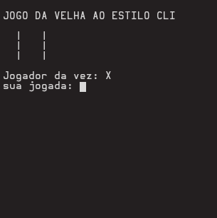
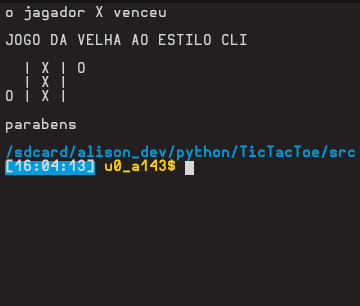
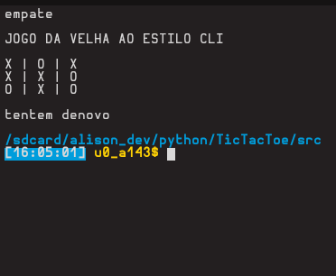

# JOGO DA VELHA CLI
## sobre o game
este é um projeto simples desenvolvido em python com o objetivo de melhorar tanto as habilidades com a linguagem quanto a logica de programação.
## imagens

## sobre mim
Eu sou um estudante de programação amante de tecnologia com muita sede em aprender cada dia mais sobre esse mundo.  
**# Desenvolvimento Web**  
**# Programador Python**
## conheça-me
[**LINKEDIN**](https://www.linkedin.com/in/alison-silva-434972201)
       [**FACEBOOK**](https://www.facebook.com/diego.dev.94)
